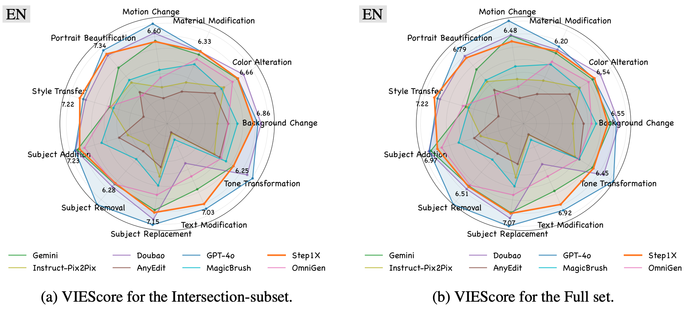

<div align="center">
  
</div>
<div align="center">
  <a href="https://step1x-edit.github.io/"></a> &ensp;
  <a href="https://arxiv.org/abs/2504.17761"></a> &ensp;
  <a href="https://www.modelscope.cn/models/stepfun-ai/Step1X-Edit"></a> &ensp;
  <a href="https://discord.gg/j3qzuAyn"></a> &ensp;
  
  <a href="https://huggingface.co/stepfun-ai/Step1X-Edit"></a> &ensp;
  <a href="https://huggingface.co/spaces/stepfun-ai/Step1X-Edit"></a> &ensp;
  <a href="https://huggingface.co/datasets/stepfun-ai/GEdit-Bench"></a> &ensp;
</div>


## 🔥🔥🔥 News!!
* Apr 27, 2025: 🎉 With community support, we update the inference code and model weights of Step1X-Edit-FP8. [meimeilook/Step1X-Edit-FP8](https://huggingface.co/meimeilook/Step1X-Edit-FP8) & [rkfg/Step1X-Edit-FP8](https://huggingface.co/rkfg/Step1X-Edit-FP8).
* Apr 26, 2025: 🎉 Step1X-Edit is now live — you can try editing images directly in the online demo! [Online Demo](https://huggingface.co/spaces/stepfun-ai/Step1X-Edit)
* Apr 25, 2025: 👋 We release the evaluation code and benchmark data of Step1X-Edit. [Download GEdit-Bench](https://huggingface.co/datasets/stepfun-ai/GEdit-Bench)
* Apr 25, 2025: 👋 We release the inference code and model weights of Step1X-Edit. [ModelScope](https://www.modelscope.cn/models/stepfun-ai/Step1X-Edit) & [HuggingFace](https://huggingface.co/stepfun-ai/Step1X-Edit) models.
* Apr 25, 2025: 👋 We have made our technical report available as open source. [Read](https://arxiv.org/abs/2504.17761)

<!-- ## Image Edit Demos -->

<div align="center">

<p><b>Step1X-Edit:</b> a unified image editing model performs impressively on various genuine user instructions. </p>
</div>


## 🧩 Community Contributions

If you develop/use Step1X-Edit in your projects, welcome to let us know.

- FP8 model weights: [meimeilook/Step1X-Edit-FP8](https://huggingface.co/meimeilook/Step1X-Edit-FP8) by [meimeilook](https://huggingface.co/meimeilook);  [rkfg/Step1X-Edit-FP8](https://huggingface.co/rkfg/Step1X-Edit-FP8) by [rkfg](https://huggingface.co/rkfg)


## 📑 Open-source Plan
- [x] Inference & Checkpoints
- [x] Online demo (Gradio)
- [ ] Diffusers 
- [x] FP8 Quantified weight
- [ ] ComfyUI


## 1. Introduction
we introduce a state-of-the-art image editing model, **Step1X-Edit**, which aims to provide comparable performance against the closed-source models like GPT-4o and Gemini2 Flash. 
More specifically, we adopt the Multimodal LLM to process the reference image and user's editing instruction. A latent embedding has been extracted and integrated with a diffusion image decoder to obtain  the target image. To train the model, we build a data generation pipeline to produce a high-quality dataset. 
For evaluation, we develop the GEdit-Bench, a novel benchmark rooted in real-world user instructions. Experimental results on GEdit-Bench demonstrate that Step1X-Edit outperforms existing open-source baselines by a substantial margin and approaches the performance of leading proprietary models, thereby making significant contributions to the field of image editing. 
More details please refer to our [technical report](https://arxiv.org/abs/2504.17761).


## 2. Model Usage
### 2.1  Requirements

The following table shows the requirements for running Step1X-Edit model (batch size = 1, w/o cfg distillation) to edit images:

|     Model    |     Peak GPU Memory (512 / 786 / 1024)  | 28 steps w flash-attn(512 / 786 / 1024) |
|:------------:|:------------:|:------------:|
| Step1X-Edit   |                42.5GB / 46.5GB / 49.8GB  | 5s / 11s / 22s |
| Step1X-Edit-FP8   |             31GB / 31.5GB/ 34GB     | 6.8s / 13.5s / 25s | 
| Step1X-Edit + offload   |       25.9GB / 27.3GB / 29.1GB | 49.6s / 54.1s / 63.2s |
| Step1X-Edit-FP8 + offload   |   18GB / 18GB / 18GB | 35s / 40s / 51s |

* The model is tested on one H800 GPUs.
* We recommend to use GPUs with 80GB of memory for better generation quality and efficiency.
* The Step1X-Edit-FP8 model we tested comes from [meimeilook/Step1X-Edit-FP8](https://huggingface.co/meimeilook/Step1X-Edit-FP8).


### 2.2 Dependencies and Installation


python >=3.10.0 and install [torch](https://pytorch.org/get-started/locally/) >= 2.2 with cuda toolkit and corresponding torchvision. We test our model using torch==2.3.1 and torch==2.5.1 with cuda-12.1.


Install requirements:
  
``` bash
pip install -r requirements.txt
```

Install [`flash-attn`](https://github.com/Dao-AILab/flash-attention), here we provide a script to help find the pre-built wheel suitable for your system. 
    
```bash
python scripts/get_flash_attn.py
```

The script will generate a wheel name like `flash_attn-2.7.2.post1+cu12torch2.5cxx11abiFALSE-cp310-cp310-linux_x86_64.whl`, which could be found in [the release page of flash-attn](https://github.com/Dao-AILab/flash-attention/releases).

Then you can download the corresponding pre-built wheel and install it following the instructions in [`flash-attn`](https://github.com/Dao-AILab/flash-attention).


### 2.3 Inference Scripts
After downloading the [model weights](https://huggingface.co/stepfun-ai/Step1X-Edit), you can use the following scripts to edit images:

```
bash scripts/run_examples.sh
```
The default script runs the inference code with non-quantified weights. If you want to save the GPU memory usage, you can 1）download the FP8 weights and set the `--quantized` flag in the script, or 2) set the `--offload` flag in the script to offload some modules to CPU.

This default script runs the inference code on example inputs. The results will look like:
<div align="center">

</div>

## 3. Benchmark
We release [GEdit-Bench](https://huggingface.co/datasets/stepfun-ai/GEdit-Bench) as a new benchmark, grounded in real-world usages is developed to support more authentic and comprehensive evaluation. This benchmark, which is carefully curated to reflect actual user editing needs and a wide range of editing scenarios, enables more authentic and comprehensive evaluations of image editing models.
The evaluation process and related code can be found in [GEdit-Bench/EVAL.md](GEdit-Bench/EVAL.md). Part results of the benchmark are shown below:
<div align="center">

</div>


## 4. Citation
```
@article{liu2025step1x-edit,
      title={Step1X-Edit: A Practical Framework for General Image Editing}, 
      author={Shiyu Liu and Yucheng Han and Peng Xing and Fukun Yin and Rui Wang and Wei Cheng and Jiaqi Liao and Yingming Wang and Honghao Fu and Chunrui Han and Guopeng Li and Yuang Peng and Quan Sun and Jingwei Wu and Yan Cai and Zheng Ge and Ranchen Ming and Lei Xia and Xianfang Zeng and Yibo Zhu and Binxing Jiao and Xiangyu Zhang and Gang Yu and Daxin Jiang},
      journal={arXiv preprint arXiv:2504.17761},
      year={2025}
}
```

## 5. Acknowledgement
We would like to express our sincere thanks to the contributors of [SD3](https://huggingface.co/stabilityai/stable-diffusion-3-medium), [FLUX](https://github.com/black-forest-labs/flux), [Qwen](https://github.com/QwenLM/Qwen2.5), [diffusers](https://github.com/huggingface/diffusers) and [HuggingFace](https://huggingface.co) teams, for their open research and exploration.


## 6. Disclaimer
The results produced by this image editing model are entirely determined by user input and actions. The development team and this open-source project are not responsible for any outcomes or consequences arising from its use.

## 7. LICENSE
Step1X-Edit is licensed under the Apache License 2.0. You can find the license files in the respective github and  HuggingFace repositories.
